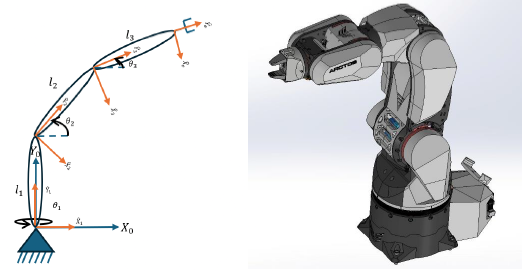

# 3-DOF Robotic Arm Navigation & Control Simulation

## Robots Motion Planning and Control Final Project
**Department of Mechanical Engineering, Ben-Gurion University of the Negev**  
**Authors:** Nave Markovich, Sharon Guberg, and Bar Mizrachi

---

## 📂 Project Resources & Quick Links
* **[📂 Full Google Drive Folder](https://drive.google.com/drive/folders/1zm56qRn-rD6BO7BeuLdP5oSVvrGnDJcr?usp=sharing)** (Contains additional simulation output videos, legacy files, and high-res figures)
* **[📄 Project Documentation (PDF)](Final%20project%20Control%20&%20Navigation.pdf)** (Detailed supplementary specifications)

---

## 🔬 Project Overview
This project presents a comprehensive framework for the modeling, simulation, and nonlinear control of a **3-Degree-of-Freedom (3-DOF) serial robotic manipulator** (inspired by the Arctos industrial robot architecture). 

The workflow spans from full symbolic kinematic and dynamic derivation using **Wolfram Mathematica** to closed-loop numerical integration and controller validation in **MATLAB (ode45)**.

  

---

## ⚙️ Mathematical & Dynamic Modeling (Wolfram Mathematica)

### 1. Kinematics & Jacobians
The generalized coordinate state vector is defined by the joint angles $q(t) = [\theta_1(t), \theta_2(t), \theta_3(t)]^T$. Linear and angular Jacobians ($J_{L_i}, J_{\omega_i}$) were derived relative to each link's center of mass (CoM) to trace linear velocities ($\dot{p}_{c_i} = J_{L_i}\dot{q}$) and body rotations.

### 2. Equations of Motion
Using the local inertia tensors and rotation matrices ($R_i$), the full rigid-body dynamic behavior was formulated via the joint-space equations of motion:

$$M(q)\ddot{q} + C(q,\dot{q})\dot{q} + G(q) = \tau$$

Where:
* $M(q)$ is the symmetric $3\times3$ mass/inertia matrix.
* $C(q,\dot{q})$ captures the nonlinear Coriolis and centrifugal effects.
* $G(q)$ is the gravity vector projecting link weights into generalized forces.
* $\tau$ is the vector of input torques applied at the revolute joints.

---

## 🚀 Control Strategy: Artificial Potential Field
To steer the end-effector to a desired Cartesian target without persistent oscillations, a nonlinear controller was developed based on an **Artificial Potential Function ($U$)** coupled with velocity damping ($K_d$):

$$\tau(q) = G(q) - \nabla U_{\text{att}}(q) - K_d\dot{q}$$

* **Gravity Compensation:** $G(q)$ actively counteracts the manipulator's structural weight.
* **Attractive Potential Field:** $U_{\text{att}} = \frac{1}{2}(q-q_d)^T K_{\text{att}}(q-q_d)$ establishes a unique global minimum at the target joint configuration ($q_d$), creating restoring torques proportional to position errors.
* **Damping Term:** $-K_d\dot{q}$ dissipates kinetic energy to guarantee asymptotic convergence analyzed via Lyapunov stability theory.

---

### 🎥 Simulation Previews

**1. Zero-Input Passive Dynamics (Conservative System Validation)**
https://github.com/user-attachments/assets/62378b88-a57a-402e-a247-23418aee10b1

**2. Closed-Loop Controlled Motion (Target Acquisition)**
https://github.com/user-attachments/assets/2075b453-9fe0-4f48-ad7f-2747b500b7ab

**3. Additional Target Trajectory**
https://github.com/user-attachments/assets/7a2cf272-4147-4410-84a7-171280ee123d

## 📂 Repository Structure & How to Run

To ensure proper execution, MATLAB functions depend on one another. Code is organized into dedicated source directories:

* `src/zero_input_dynamics/` - MATLAB files for simulating natural system dynamics without control input.
* `src/potential_field_control/` - MATLAB files for the closed-loop controller driving the arm toward a Cartesian target.
* `src/symbolic_derivation/` - Contains the full symbolic derivation notebook (`Full_Kinematics.nb`).

*(Note: Download all `.m` files within a specific `src` directory together before executing the main script).*

---

## 📊 Simulation Output Naming Convention 
External simulation videos and graphs (hosted on the connected Google Drive) follow a strict naming convention to describe the motion parameters:

**Format:** `start_<theta1>_<theta2>_<theta3>_end_<x>_<y>_<z>`
* **Start values** represent initial joint angles in degrees.
* **End values** represent the desired Cartesian target point (in meters).
* The letter `m` denotes a minus sign ($-$). E.g., `m04` = $-0.4$.
* A leading `0` represents a decimal. E.g., `02` = $0.2$.
* `Deff` implies the predefined default target point was used.

*Example:* `start_0_90_0_end_02_m04_m001` corresponds to an initial configuration of $\theta=[0^\circ, 90^\circ, 0^\circ]$ and a target of $x=0.2, y=-0.4, z=-0.01$.

---

## 🛠️ Tech Stack & Tools Used
* **MATLAB / Simulink:** Numerical integration (`ode45`), closed-loop simulation, and stick-figure trajectory animation.
* **Wolfram Mathematica:** Symbolic derivation of center-of-mass positions, Jacobians, and matrix differentiations.
* **SolidWorks:** 3D mechanical assembly, rigid-link parameter extractions (mass, length, inertia tensors).
